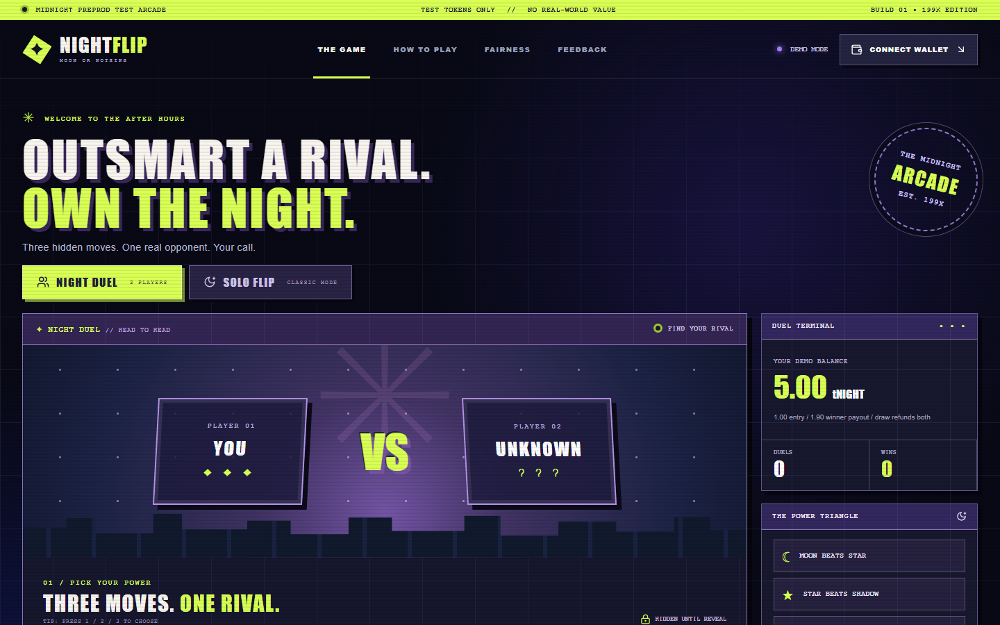
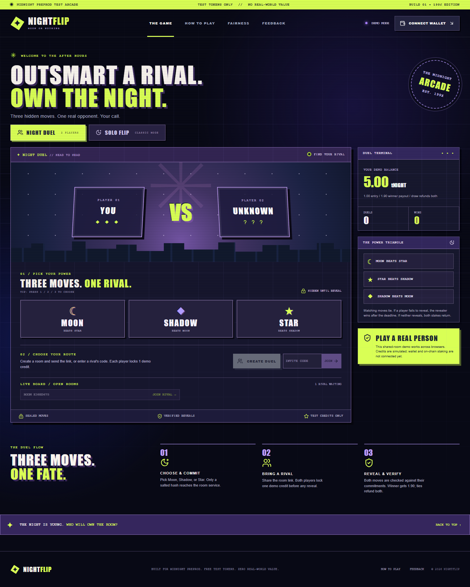
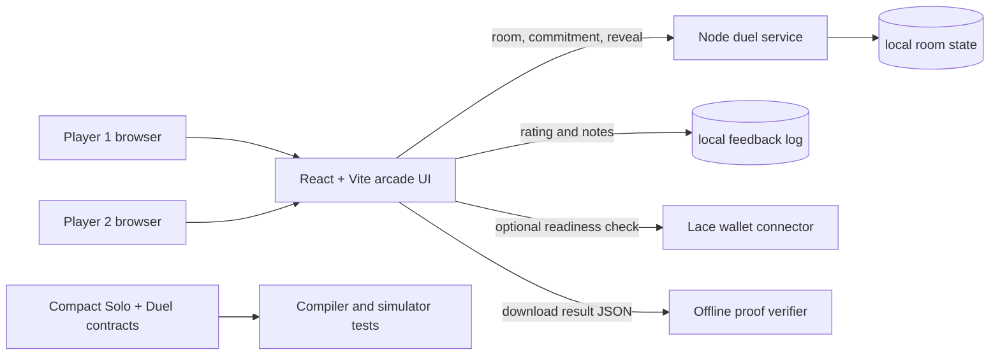

# NightFlip

[](https://www.typescriptlang.org/)
[](https://react.dev/)
[](https://midnight.network/)
[](https://github.com/debojyoti10CC/nightflip/actions/workflows/web-checks.yml)

<p align="center">
  
</p>

**A late 1990s arcade inspired Midnight game with hidden moves, a real opponent, and independently checkable reveals.** Night Duel extends the original Solo Flip MVP with simultaneous Moon, Shadow, or Star choices, two browser rooms, fixed stakes, deadlines, and a downloadable proof. The playable browser build uses **simulated credits**. Its Compact contracts compile and pass simulator tests, but the app does **not** submit Preprod transactions and the contracts are **not deployed**.

| | |
| --- | --- |
| **Repository** | [github.com/debojyoti10CC/nightflip](https://github.com/debojyoti10CC/nightflip) |
| **Playable demo** | Run locally at `http://127.0.0.1:5173/` using the commands below; container and public deployment steps in [the runbook](docs/DEPLOY.md) |
| **Browser demo video** | [Watch the two-player and Solo Flip recording](docs/video/nightflip-browser-demo.mp4); Preprod transaction footage pending |
| **Preprod participant wallets** | 0 collected or verified for this game; 70 genuine on-chain participants required for the stated submission goal |
| **Contract address** | None; neither Compact contract is deployed |
| **Feedback record** | [Collection process and decision log](docs/FEEDBACK.md) |
| **Network** | Midnight Preprod target; current browser rounds are off-chain simulations |
| **Submission evidence** | [Level 5 checklist and release gates](docs/SUBMISSION.md) |

---

## User flow

<p align="center">
  
</p>

1. Pick **Moon**, **Shadow**, or **Star**. Moon beats Star; Star beats Shadow; Shadow beats Moon.
2. Create a room and share the invite link, or join an open room from a second browser.
3. Each player locks one simulated credit and sends a salted commitment to the room service. The move stays hidden until reveal.
4. Both players reveal. A win pays 1.90 simulated credits, a tie refunds both stakes, and the remaining 0.10 on a decisive result represents the intended fee.
5. Inspect the revealed commitments and download the proof JSON. Run the local verifier to check it outside the browser.

The **Solo Flip** tab keeps the original one-player Moon/Shadow game available as a separate mode.

---

## Table of contents

1. [Project overview](#1-project-overview)
2. [Key features](#2-key-features)
3. [Architecture](#3-architecture)
4. [Game rules and complete workflow](#4-game-rules-and-complete-workflow)
5. [Fairness and proof verification](#5-fairness-and-proof-verification)
6. [Midnight contract and Preprod status](#6-midnight-contract-and-preprod-status)
7. [Feedback loop](#7-feedback-loop)
8. [Documentation](#8-documentation)
9. [Submission checklist](#9-submission-checklist)
10. [Technology stack and repository structure](#10-technology-stack-and-repository-structure)
11. [Security and privacy](#11-security-and-privacy)
12. [Run and reproduce](#12-run-and-reproduce)

---

## 1. Project overview

The first NightFlip MVP was a private Moon/Shadow coin flip. It had the feel of a small arcade interaction, but little player choice. Night Duel adds an opponent and a three-move strategy triangle while keeping the original mode. Its room service lets two separate browsers play the same round; commitments prevent either player from changing a move after seeing the rival's reveal.

The visual direction is intentionally loud: oversized type, neon lime and violet, scan lines, hard borders, skyline silhouettes, and cabinet-style panels. Gameplay is designed around a clear three-step loop: **choose, commit, reveal**.

Midnight is the intended chain for a later on-chain release. The repository includes Compact models of Solo Flip and Night Duel, but the browser currently uses a Node room service and simulated credits. Connecting a compatible Lace wallet only checks Preprod readiness; it does not authorize, sign, or submit a game transaction.

## 2. Key features

| Feature | What it does | Implementation | Current status |
| --- | --- | --- | --- |
| **Night Duel** | Two players choose among Moon, Shadow, and Star | `app/src/Duel.tsx`, `services/duel/game.mjs` | Playable in two browsers with demo credits |
| **Shared rooms** | Invite link, join code, and open room board | `services/duel/server.mjs` | Local service; no public host yet |
| **Commit and reveal** | Hides choices until reveal and checks salted SHA-256 commitments | `app/src/game/duel.ts`, room service | Browser demo proof, not a ZK or on-chain proof |
| **Deadline settlement** | Handles unjoined rooms, one-sided reveal, and no reveal | `services/duel/game.mjs` | Implemented and tested in the demo |
| **Proof export** | Saves result JSON for independent local checking | `scripts/verify-proof.mjs` | Implemented for completed demo rounds |
| **Solo Flip** | Preserves the original Moon/Shadow mode | `app/src/App.tsx`, `app/src/game/demo.ts` | Playable with simulated credits |
| **Wallet readiness** | Checks a compatible Lace connector and Preprod network | `app/src/wallet/lace.ts` | Connection check only |
| **Compact protocols** | Models stakes, hidden commitments, payout, and refunds | `contract/src/nightflip.compact`, `contract/src/nightduel.compact` | Compile and pass simulator tests; undeployed |
| **In-app feedback** | Collects ratings and categorized notes | `services/duel/feedback.mjs` | Local collection and fallback; real beta cohort pending |

## 3. Architecture



The Compact branch in this diagram is a **development and test path**. It is not connected to the playable browser flow. The demo's SHA-256 commitment format is also different from Compact's `persistentCommit`; an on-chain client must implement the latter before deployment. See the [duel trust model](docs/DUEL.md).

## 4. Game rules and complete workflow

| Move | Beats |
| --- | --- |
| Moon | Star |
| Star | Shadow |
| Shadow | Moon |

Each player starts a demo session with 5 simulated credits. A Night Duel locks 1.00 from each participant. A decisive winner receives 1.90 and 0.10 is the intended fee; equal moves refund 1.00 each. An unjoined room refunds its creator after five minutes. After a rival joins, players have three minutes to reveal: a sole revealer wins by forfeit; if neither reveals, both are refunded. These numbers and timeouts are demo rules, not real token transfers.

1. **Create or join:** The first player selects a move, opens a room, and shares its link or code. The second player joins from another browser.
2. **Commit:** Each browser generates a random salt and sends a hash of its move and salt. Neither move is sent during this step.
3. **Reveal:** Players send their moves and salts. The service checks each against the earlier hash and applies the rules above.
4. **Review:** The result panel shows both commitments and revealed values. Players can save the proof and verify it locally.

Solo Flip uses its own one-player flow and exports a compatible **demo** proof from its fairness panel. Full rules and edge cases are in [docs/DUEL.md](docs/DUEL.md).

## 5. Fairness and proof verification

The browser hashes `nightflip-duel-v1:<move>:<salt>` with SHA-256 before reveal. The service rejects a reveal that does not match the stored hash. After a round completes, the proof records the committed and revealed values so someone else can recalculate the result.

```sh
npm run proof:verify -- path/to/duel-proof.json
```

The verifier rejects unknown proof protocols and checks the commitments and winner. This establishes consistency between the exported reveal data and the earlier demo hashes. It does **not** prove that a Midnight transaction occurred, that the room service was honest about all prior state, or that the two browsers belong to distinct people.

## 6. Midnight contract and Preprod status

Two Compact contracts live under `contract/src/`:

- `nightflip.compact` models the original private Moon/Shadow stake, committed operator seed, claim, and timeout refund.
- `nightduel.compact` models two-player commitments, reveals, payout, tie, and deadline settlement.

Both compile with the local Compact toolchain and have simulator tests. Neither is deployed, independently audited, or wired into the browser. The [network status](docs/NETWORK.md) records the compiler compatibility and advisory gate that must be resolved before a safe Preprod deployment. The [deployment plan](docs/DEPLOY.md) lists the required wallet binding, funded transactions, proof service, indexer, and end-to-end payout checks.

**Verified Preprod user wallets for NightFlip: 0.** A real participant list needs 70 distinct consenting users with wallet addresses and independently verifiable on-chain participation. Demo room sessions and wallet connection checks do not count. The proposed evidence fields and verification criteria are in [docs/SUBMISSION.md](docs/SUBMISSION.md).

## 7. Feedback loop

Players can submit a rating and categorized note in the app. The room service validates and stores responses in ignored `data/feedback.jsonl`; if the service is unavailable, the browser labels its local fallback. The repository's [feedback log](docs/FEEDBACK.md) records the collection process, a real project-owner request that drove Night Duel, and a template for tracking later beta decisions and retests.

```sh
npm run feedback:summary
```

The summary script reports counts and average ratings without printing free-text messages. A genuine 70-user beta and follow-up decisions are still pending.

## 8. Documentation

| Document | Purpose |
| --- | --- |
| [Duel rules and trust model](docs/DUEL.md) | Strategy, commitments, timeout behavior, and limitations |
| [Contract notes](contract/README.md) | Compact circuits, compiler, and simulator scope |
| [Network status](docs/NETWORK.md) | Preprod compatibility snapshot and deployment gate |
| [Deployment plan](docs/DEPLOY.md) | Steps and evidence required for a real release |
| [Feedback log](docs/FEEDBACK.md) | Collection, decisions, and beta template |
| [Build plan](docs/BUILD_PLAN.md) | Development milestones |
| [Submission evidence](docs/SUBMISSION.md) | Level 5 checklist and participant verification format |

## 9. Submission checklist

The stated Level 5 target includes the extended MVP, 70 verified Preprod users, feedback documentation, updated docs, a public repository, a live link, a full demo video, and at least 30 meaningful commits. The more demanding commit threshold is used here.

| Requirement | Evidence now | Status |
| --- | --- | --- |
| Extended MVP | Solo Flip plus two-browser Night Duel, demo proof export, Compact protocols | Local demo complete; Preprod integration pending |
| Public GitHub repository | [nightflip](https://github.com/debojyoti10CC/nightflip) | Complete |
| Updated documentation | README and linked technical/release documents | Complete for current local build |
| Feedback loop | In-app form and [decision log](docs/FEEDBACK.md) | Documented; beta follow-up pending |
| 30 meaningful commits | Scoped history on `main`; inspect with `git log --oneline` | Met |
| Live demo link | Local UI and room service only | Pending public hosting |
| 70 verifiable Preprod wallet addresses | No genuine cohort evidence collected | Pending |
| Funded Preprod contract use | No deployment or game transactions | Pending |
| Full MVP demo video | [Browser demo recording](docs/video/nightflip-browser-demo.mp4) covers multiplayer, Solo Flip, and fairness | Preprod transaction footage pending |

The repository does not substitute simulated sessions, unrelated wallet lists, or invented transaction IDs for submission evidence.

## 10. Technology stack and repository structure

**Frontend:** React 19, TypeScript 5.9, Vite 7, CSS, Lucide icons. **Multiplayer:** Node.js room service with JSON state and feedback storage. **Protocol:** Midnight Compact contracts and simulator tests. **Verification:** Web Crypto SHA-256 in the browser and a Node proof checker. **CI:** GitHub Actions for foundation, web build, and room service checks; Compact checks run separately with the Linux toolchain.

The [single-origin Docker build](docs/DEPLOY.md) serves the compiled UI and room API together and requires a private persistent volume for public hosting.

```text
nightflip/
├── app/                  React arcade UI, modes, wallet readiness
├── services/duel/        Room API, game rules, feedback, tests
├── contract/             Solo and Duel Compact contracts, simulator tests
├── scripts/              Dev runner, compilation, proof and feedback tools
├── docs/                 Rules, release evidence, plans, screenshots
└── .github/workflows/    Web and room checks
```

## 11. Security and privacy

- Demo credits have no monetary value. The app has no purchases, redemption, prizes, or real token transfers.
- The room service receives hidden-move hashes at commitment and the moves and salts at reveal. It controls demo settlement and stores local room state. The browser keeps round state during play.
- A browser proof is a check of hash consistency, not a zero-knowledge proof or chain receipt.
- Feedback may contain user-written text. Keep the ignored `data/` directory private; avoid entering wallet addresses or personal information into feedback.
- Never enter a seed phrase into this app or commit one to the repository. Connecting a wallet is only a readiness check in the current build.

## 12. Run and reproduce

Install Node.js **22.15+** and npm. The command below starts both the Vite UI at `http://127.0.0.1:5173/` and the room service at `http://127.0.0.1:8787/`.

```sh
npm install
npm run dev
```

Open two different browsers or a normal and private window. In the first, choose a move and create a Night Duel room. Open its link in the second, choose a move, and join. Reveal from both windows to see the result. Room state is saved in ignored `data/duel-state.json` and feedback in ignored `data/feedback.jsonl`.

```sh
npm run check
npm run build
npm run test
npm run proof:verify -- path/to/duel-proof.json
```

Contract compilation requires the official Linux Compact toolchain; on Windows this project uses WSL Ubuntu:

```sh
npm run compile -w @nightflip/contract
```

Compilation and simulator tests establish local protocol behavior only. Follow the [network status](docs/NETWORK.md) and [deployment plan](docs/DEPLOY.md) before attempting a Preprod release.
