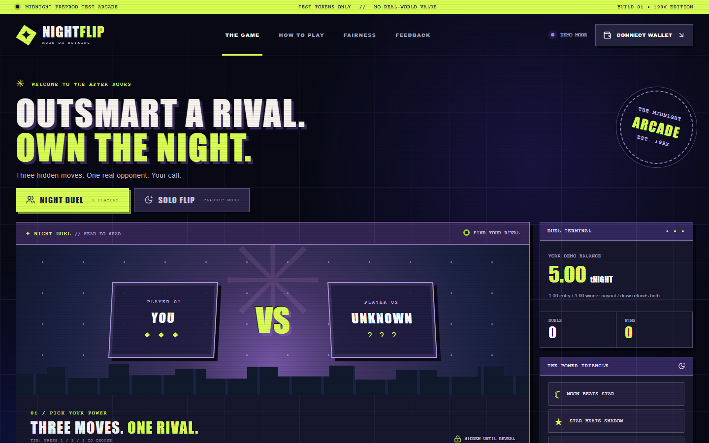
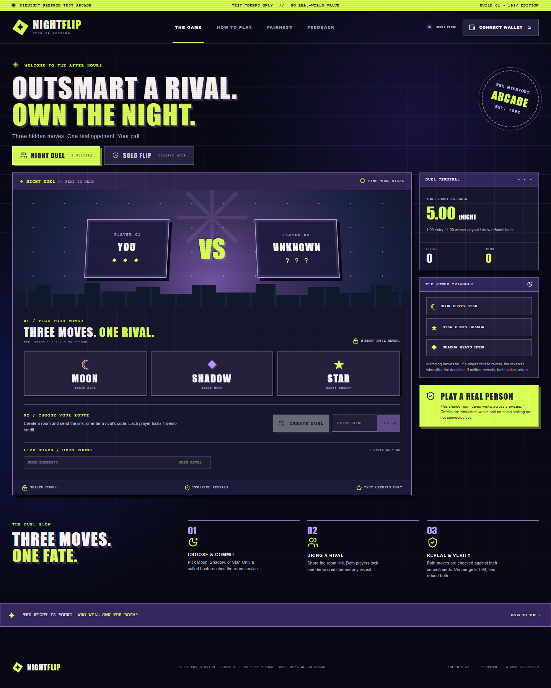

# NightFlip

[](https://www.typescriptlang.org/)
[](https://react.dev/)
[](https://midnight.network/)
[](https://github.com/debojyoti10CC/nightflip/actions/workflows/web-checks.yml)

<p align="center">
  
</p>

**NightFlip is a midnight arcade game built around hidden choices, rival reads, and a reveal that settles the round.** Play a fast two-player Night Duel in the browser, or enter the Midnight table through Lace on Preprod.

| | |
| --- | --- |
| **Play online** | [nightflip-arcade.onrender.com](https://nightflip-arcade.onrender.com) |
| **Game modes** | Night Duel multiplayer and Solo Flip |
| **Midnight network** | Preprod |
| **NightFlip contract** | [`c9c248ccee39612a2e8546c244f5b5da4f66b25ae04ace2936086690df1dfa40`](docs/PREPROD_RECEIPTS.md) |
| **Feedback** | [In-game collection and decision log](docs/FEEDBACK.md) |
| **Browser recording** | [Night Duel and Solo Flip](docs/video/nightflip-browser-demo.mp4) |

---

## Play Night Duel

<p align="center">
  
</p>

1. Choose **Moon**, **Shadow**, or **Star**. Moon beats Star; Star beats Shadow; Shadow beats Moon.
2. Create a room and share the invite link, or enter a rival's room code.
3. Both players lock a hidden move through a salted commitment.
4. Reveal to settle the duel. A win pays 1.90 simulated credits, a draw refunds both entries, and a missed reveal settles by timeout.
5. Inspect the completed round or download its proof JSON for a local verification pass.

Solo Flip keeps the original Moon-or-Shadow arcade round available as a separate mode.

## Product overview

NightFlip keeps the pressure of a one-button arcade game, then adds the decision that makes the next round matter. Night Duel is a simultaneous three-move game: players commit before either move is revealed, so the opponent cannot counter after seeing a choice.

The visual language is loud and deliberate: neon lime, violet panels, skyline silhouettes, scan lines, hard borders, oversized type, and staged status cues that make each part of a round easy to follow.

## Features

| Feature | Experience | Technology |
| --- | --- | --- |
| **Night Duel** | Two-player Moon, Shadow, Star strategy | React UI and Node room service |
| **Shared rooms** | Invite links, join codes, and open-room board | Same-origin HTTP API |
| **Commit and reveal** | Moves stay sealed until both players reveal | Salted SHA-256 commitments |
| **Timeout settlement** | Handles unmatched rooms, forfeits, and refunds | Room-game rule engine |
| **Solo Flip** | Fast one-player Moon-or-Shadow rounds | Browser arcade mode |
| **Lace table** | Wallet connection, private call, and claim flow | Midnight.js and Lace DApp Connector |
| **Compact protocols** | Private stake, reveal, payout, and refund rules | Midnight Compact |
| **Feedback** | Ratings and notes from the arcade | Local room-service feedback API |

## How a round works

| Move | Beats |
| --- | --- |
| Moon | Star |
| Star | Shadow |
| Shadow | Moon |

Each Night Duel session starts with 5 simulated credits. Entering a duel locks 1.00 from each side. A decisive round awards 1.90 to the winner; matching moves refund both players. A creator receives a refund if no rival joins, and a reveal timeout resolves the round by forfeit or refund.

1. **Lock in** — each browser creates a random salt and commits a hash of the selected move.
2. **Reveal** — players disclose their move and salt; the service verifies the commitment.
3. **Settle** — the result panel shows the round outcome, both commitments, and the revealed values.
4. **Review** — download the proof JSON and check it locally with `npm run proof:verify -- path/to/duel-proof.json`.

## Midnight table

NightFlip includes a browser-side Lace client for the deployed Midnight Preprod contract. The client verifies the contract state, keeps a player's private selection material in the browser, and submits the contract calls through the connected wallet.

The deployed contract, bankroll lifecycle, and current revealed round are recorded in [Preprod receipts](docs/PREPROD_RECEIPTS.md). The browser room game and the Compact table use separate commitment systems: the room game uses SHA-256 while the Compact contract uses Midnight `persistentCommit`.

## Arcade feedback

Players can send a rating and categorized note from the game. The room service validates each response and stores it in private local application data, with a browser fallback when the service is unavailable. The [feedback log](docs/FEEDBACK.md) tracks product decisions that shape NightFlip.

```sh
npm run feedback:summary
```

## Documentation

| Document | Purpose |
| --- | --- |
| [Night Duel rules](docs/DUEL.md) | Moves, commitments, timeouts, and trust model |
| [Contract notes](contract/README.md) | Compact protocol rules and integration notes |
| [Network notes](docs/NETWORK.md) | Midnight Preprod compatibility and endpoints |
| [Deployment guide](docs/DEPLOY.md) | Container and hosting setup |
| [Preprod receipts](docs/PREPROD_RECEIPTS.md) | Deployed NightFlip contract lifecycle |
| [Feedback log](docs/FEEDBACK.md) | Product feedback and decisions |

## Stack

- **Frontend:** React, TypeScript, Vite, CSS, and Lucide.
- **Multiplayer:** Node.js room service with persisted local state.
- **Protocol:** Midnight Compact contracts and Lace wallet integration.
- **Verification:** Browser SHA-256 commitments and a Node proof checker.
- **Delivery:** Docker, Render, and GitHub Actions.

```text
nightflip/
├── app/                  React arcade UI and wallet connection
├── services/duel/        Multiplayer rooms, feedback, and tests
├── contract/             NightFlip and Night Duel Compact protocols
├── scripts/              Development, verification, and QA tools
└── docs/                 Product, network, and deployment notes
```

## Run locally

Install Node.js **22.15+** and npm, then start the arcade and room service:

```sh
npm install
npm run dev
```

Open two browsers or a normal and private window. Create a Night Duel room in one, join from the other, then reveal from both sides.

```sh
npm run check
npm run build
npm run test
npm run proof:verify -- path/to/duel-proof.json
```

Contract compilation requires the official Linux Compact toolchain. On Windows, this project uses WSL Ubuntu:

```sh
npm run compile -w @nightflip/contract
```
